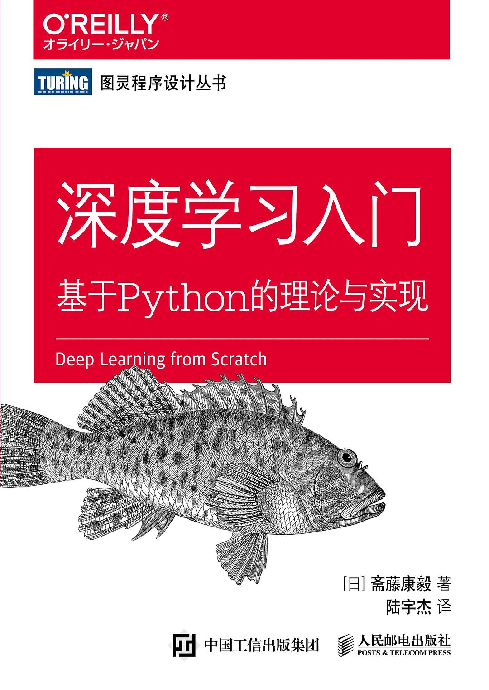
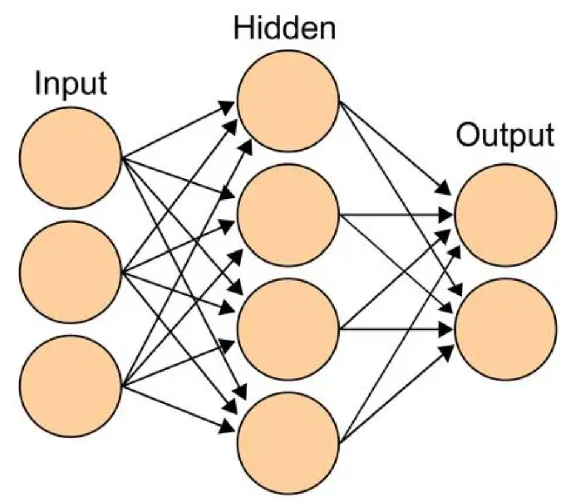
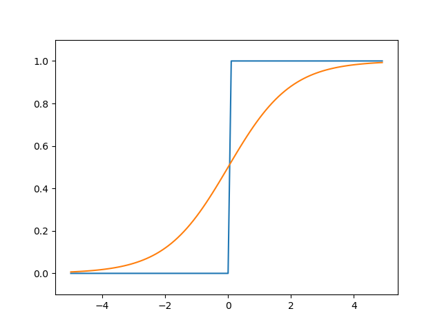
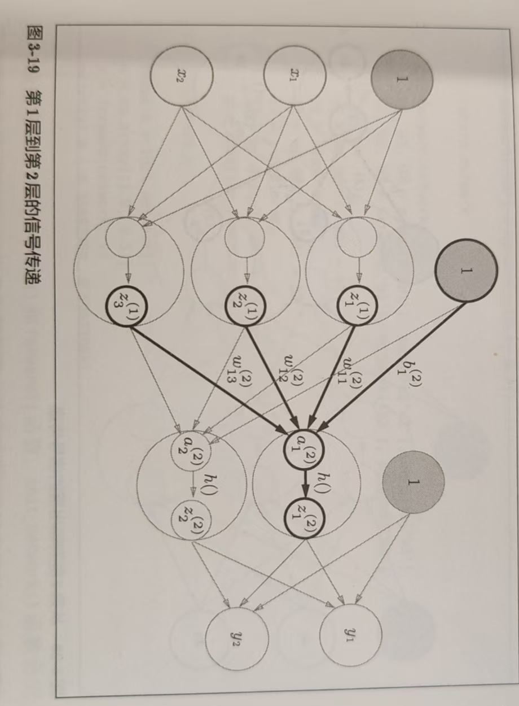
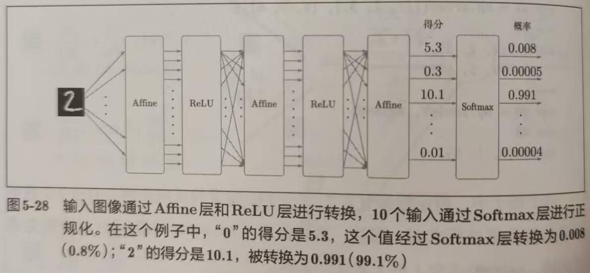
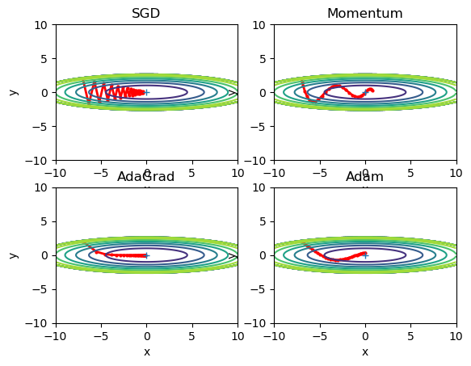
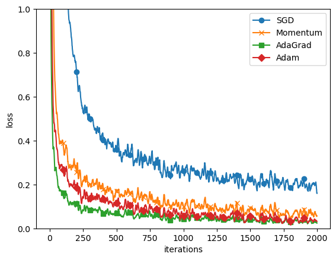
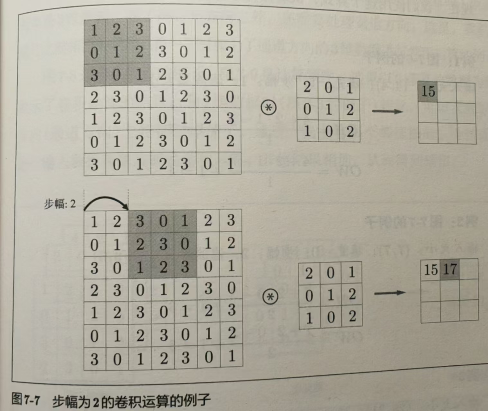
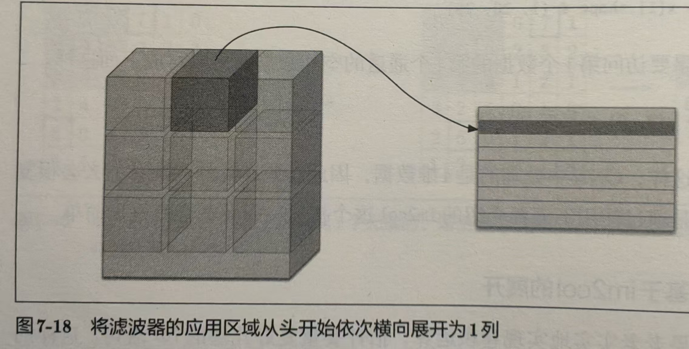
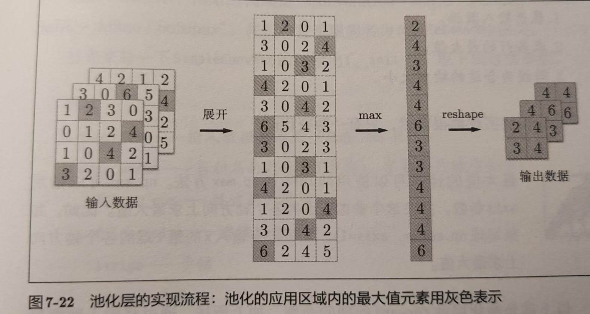

简述《深度学习入门1：基于Python的理论与实现》的内容，完整代码见[这](http://github.com/oreilly-japan/deep-learning-from-scratch)，建议直接看 notebook，可以直接运行里面的代码（common 和 dataset 位置使然）。

## 第一章 Python 入门

1. 卸载电脑上已有的 Python 
2. [安装 Anaconda](https://blog.csdn.net/weixin_43412762/article/details/129599741?ops_request_misc=%257B%2522request%255Fid%2522%253A%2522BA7A513D-1428-4D32-921E-FB5C6CF5ADA5%2522%252C%2522scm%2522%253A%252220140713.130102334..%2522%257D&request_id=BA7A513D-1428-4D32-921E-FB5C6CF5ADA5&biz_id=0&utm_medium=distribute.pc_search_result.none-task-blog-2~all~top_positive~default-1-129599741-null-null.142^v100^control&utm_term=anaconda%E5%AE%89%E8%A3%85&spm=1018.2226.3001.4187)
3. 检查 Anaconda 和 Python 版本

## 第二章 感知机 

最简单的感知机有两个输入（又称节点或神经元）和一个输出（ 0 或 1 ）

$f(n)=\begin{cases}0, & b + \omega_1x_1+\omega_2x_2 \leq 0\\1, & b+\omega_1x_1+\omega2_x2 > 0\end{cases}$

它相当于用一根线分割平面（ x1 和 x2 为两轴），即线性规划。它可以很容易的表示出**与门、非门、或门**。而对于异或门这样无法通过一根直线分开的情况则需要通过多个组合。

与门的示例代码：

```python
import numpy as np

def AND(x1, x2):
    x = np.array([x1, x2])
    w = np.array([0.5, 0.5])
    b = -0.7
    tmp = np.sum(w*x) + b
    if tmp <= 0:
        return 0
    else:
        return 1

if __name__ == '__main__':
    # 检查是否为主程序运行。
    for xs in [(0, 0), (1, 0), (0, 1), (1, 1)]:
        y = AND(xs[0], xs[1])
        print(str(xs) + " -> " + str(y))
```

`w`为权重，控制输入信号的重要程度；偏置`b`是调整神经元被激活的容易程度，**可以视为增加一个值为1的输入，这时偏置即是它的各项权值**。

## 第三章 神经网络

### 激活函数



本书把输入层称为第0层，上图中中间层就是第1层，输出层为第2层；含有权重的层数为神经网络的层数，上图为“2层网络”。

将感知机中式子改写为

$y=h(b+\omega_1x_1+\omega_2x_2)$

$h(x)=\begin{cases}0, & x \leq 0\\1, & x > 0\end{cases}$

激活函数就是`h(x)`，决定如何激活输入信号。上式的激活函数为**阶跃函数**。神经网络和感知机的神经元的多层链接、信号传递方法等都基本一样，主要区别在于前者采用不同的激活函数——**sigmoid函数**。

$h(x)=\frac{1}{1+e^{-x}}$

阶跃函数和sigmoid函数图形和代码：


```
# coding: utf-8
import numpy as np
import matplotlib.pylab as plt

def step_f(x):
    y = x>0
    return y.astype(np.int32)
    #或者return np.array(x > 0, dtype=int)

def sigmoid_f(x):
    return 1/(1+np.exp(-x)) #支持np数组利用了Numpy广播功能

X = np.arange(-5.0, 5.0, 0.1)
Y1 = step_f(X)
Y2 = sigmoid_f(X)
plt.plot(X, Y1)
plt.plot(X, Y2)
plt.ylim(-0.1, 1.1) 
plt.show()
```

它们都是非线性信号（因为任意多层的线性信号都有等效的单层线性网络，这样叠加层就没意义了）。相比阶跃函数，sigmoid函数能输出连续的实数值信号。神经网络发展过程中，也开始使用**ReLU函数**(Rectified Linear Unit)。

$h(x)=\begin{cases}x, & x \leq 0\\0, & x > 0\end{cases}$

### 用矩阵表示

矩阵相乘要求前一个矩阵的第1维与第二个矩阵第0维的元素数量一致，用`np.dot(A,B)`实现。我们可以采用矩阵相乘来处理神经网络。例如对于三输入的第一层神经元（3个神经元）我们有：

$A^{(1)}=XW^{(1)}+B^{(1)}$

$A^{(1)}=(a^{(1)}_1\quad a^{(1)}_2\quad a^{(1)}_3),\quad X=(x_1\quad x_2),\quad B^{(1)}=(b^{(1)}_1\quad b^{(1)}_2\quad b^{(1)}_3),\quad W=\begin{pmatrix}
W^{(1)}_{11}&W^{(1)}_{21}&W^{(1)}_{31}\\
W^{(1)}_{12}&W^{(1)}_{22}&W^{(1)}_{32}\\
\end{pmatrix}$

权重下标第一个数字表示连接到后一层的第x个神经元，第二个数字表示前一层的第x个神经元，上标表示第x层的权重。用图来理解一下吧！



**矩阵 a*b (a行b列) 就表示有 a 个输入，b 个输出。**

### 输出层设计

保持统一，我们输出层也会有一个激活函数，但是用`σ()`(sigma)表示，根据问题性质决定：**回归问题用恒等函数；二元分类用sigmoid；多元分类可以用softmax函数**。输出层神经元数量也与问题相关，多元分类中设定为类别的数量。

**分类问题是判断数据属于哪一个类别；回归问题是根据某个输入预测一个（连续的）数值的问题。**

恒等函数是按原样输出；softmax函数如下式所示：

$$y_k=\frac{exp(a_k)}{\sum_{i=1}^nexp(a_i)}$$

输出层各个神经元都受所有输入信号的影响，如图。

但在计算机计算时可能会出现溢出的问题，对此只需要找到最大的`ak`项，分子分母同除`e^ak`即可。还可以注意到输出总和必定为1，因此可以**将softmax函数的输出解释为概率**，即分为哪一类的概率为多少多少。事实上最大的ak对应必然有最大的分子，所以可以省略softmax，只是因为该函数和神经网络学习有关（下一章）。

### 手写数字识别

以下为书提供的代码，以及我的注释，尝试在官方库的 notebooks 文件夹下 ch03 对应代码中直接运行。

```python
import sys, os
sys.path.append(os.pardir)  #为了导入父目录中的文件进行的设定
import numpy as np 
import pickle #针对序列化对象的包
from dataset.mnist import load_mnist #导入提供的数据集
from common.functions import sigmoid, softmax #从提供的common获得激活函数
#获取数据
def get_data():
    (x_train, t_train), (x_test, t_test) = load_mnist(normalize=True, flatten=True, one_hot_label=False)
    return x_test, t_test
#通过序列化对象文件获取三层的权重和偏置
def init_network():
    with open("../ch03/sample_weight.pkl", 'rb') as f:
        network = pickle.load(f)
    return network
#根据权重和偏置构建神经网络获得输出
def predict(network, x):
    W1, W2, W3 = network['W1'], network['W2'], network['W3']
    b1, b2, b3 = network['b1'], network['b2'], network['b3']

    a1 = np.dot(x, W1) + b1
    z1 = sigmoid(a1)
    a2 = np.dot(z1, W2) + b2
    z2 = sigmoid(a2)
    a3 = np.dot(z2, W3) + b3
    y = softmax(a3)

    return y

x, t = get_data()
network = init_network()
accuracy_cnt = 0
for i in range(len(x)):
    y = predict(network, x[i])
    p= np.argmax(y) #获取概率最高的元素索引
    if p == t[i]: #判断是否预测对
        accuracy_cnt += 1

print("准确度:" + str(float(accuracy_cnt) / len(x)))
```

该代码的三层神经网络输入层有 784 哥神经元，对应 28*28 个像素；输出层为 10 个神经元，对应要识别的 10 个数字；神经网络有 2 个隐藏层，第 1 个隐藏层有 50 个神经元，第 2 个隐藏层有 100 个神经元。

load_mnist 函数中 normalize 为 true 将图像像素除以 255 ，使其值在 0-1 之间，这叫**正规化**。这属于一种输入数据的**预处理**。

我们可以将 100 张照片打包作为一次的输入，即 100*784 的输入矩阵，这种处理方式叫**批处理**。代码如下：

```python
batch_size = 100 
accuracy_cnt = 0

for i in range(0, len(x), batch_size):
    x_batch = x[i:i+batch_size]
    y_batch = predict(network, x_batch)
    p = np.argmax(y_batch, axis=1)
    accuracy_cnt += np.sum(p == t[i:i+batch_size])
```

## 第四章 神经网络的学习

神经网络的特征就是可以从数据中学习——**自动决定权重参数**。

- 输入 -> 人想到的特征量（SIFT、HOG）-> 机器学习（SVM、KNN）-> 答案
- 输入 -> 神经网络（深度学习）-> 答案

机器学习中分**训练数据**和**测试数据**（监督数据）。人们通过训练数据得到的模型在测试数据中评估结果。人总是期望获得**泛化能力**强的结果（能有更广泛的应用），而不是**过拟合**的（仅对于部分数据有很好的结果）。

### 损失函数

我们用**损失函数**表示神经网络性能的“恶劣程度”的指标，即当前的神经网络对监督数据在多大程度上不拟合，在多大程度上不一致。

**均方误差**：

$E=\frac{1}{2}\sum_k(y_k-t_k)^2$

`yk`为神经网络的输出，`tk`表示监督数据，`k`为数据的维度。例如手写字识别中，对于其中一个图的识别：

\>>> y = [0.1, 0.05, 0.6, 0.0, 0.05, 0.1, 0.0, 0.1, 0.0, 0.0]

\>>> t = [0, 0, 1, 0, 0, 0, 0, 0, 0, 0]
（正确解为 1，其他标签表示 0 的方法叫**one-hot**）

可以求得均方误差约为 0.0975。若数字概率最高的是 7 (0.6) ，则会有更大的均方误差 0.595。

**交叉熵误差**：

$E=-\sum_kt_klogy_k$

`tk`也采用 one-hot ，所以只计算正确解对应的自然对数。越准，误差越小。如果要求所有训练数据的损失函数的总和，以交叉熵为例，可以写成：

$E=-\frac{1}{N}\sum_n\sum_kt_{nk}logy_{nk}$

如果以全部数据为对象求误差花费时间较长，所以我们从全部数据中选出一部分作为近似。比如随机取 100 个数据进行学习，这种学习方式称为 **mini-batch** 学习。

```python
def cross_entropy_error(y,t):
    if y.ndim == 1:
        t = t.reshape(1, t.size)
        y = y.reshape(1, y.size)

    batch_size = y.shape[0]
    return -np.sum(t * np.log(y + 1e-7)) / batch_size
```

注意 1e-7 是为了防止值为0，log 取到无穷。如果是非 one-hot 标签形式的，最后一句更改为：

```python
return -np.sum(np.log(y[np.arrange(batch.size), t] + 1e-7)) / batch_size
```

用识别精度作为调参的指标可能出现变化不连续、可能不明显的问题。但损失函数对于参数变化较敏感且变化连续。可以通过导数找到损失函数最小的点，也就是找到最优参数（权重和偏置）。

计算机中求导数用微小的差分（如中心差分）实现，称为数值微分。偏导数是求多个变量的函数在某点对某个变量的导数。梯度是由全部变量的偏导数汇总而成的向量。我们可以用梯度为 0 找损失函数的最小值。尽管梯度为 0 不代表是最小值，函数的极小值、最小值以及被称为鞍点的地方梯度都为 0 ，但沿着它的方向可以最大限度地减小函数的值。这种不断演梯度方向前进，逐渐减小函数值的过程就是**梯度法**。

$x_0 = x_0-\eta\frac{\partial f}{\partial x_0}$

$x_1 = x_1-\eta\frac{\partial f}{\partial x_1}$

上两式子要不断执行去更新。`η`是**学习率**，决定一次学习中应该学习多少，过大过小都无法抵达一个好的位置，一般要一遍改变学习率一边确认学习是否正确进行。学习率属于**超参数**，由人工设定。

对权重参数矩阵求梯度如下式，`L`为损失函数：

$\frac{\partial L}{\partial W}=\begin{pmatrix}
\frac{\partial L}{\partial w_{11}}&\frac{\partial L}{\partial w_{12}}&\frac{\partial L}{\partial w_{13}}\\
\frac{\partial L}{\partial w_{21}}&\frac{\partial L}{\partial w_{22}}&\frac{\partial L}{\partial w_{23}}\\
\end{pmatrix}$

### 学习算法的实现

1. mini-batch：随机选出一部分数据
2. 求损失函数的梯度
3. 权重参数沿梯度方向更新
4. 重复 1-3

我们会定期评价神经网络的泛化能力，这个“期”就是一个**epoch**，即所有训练数据均被使用过一次。例如 10000个数据，随机打乱，以 100个数据为一个 mini-batch 编号 0-99，依次取，遍历一遍就是一个epoch.

## 第五章 误差反向传播法

用数值微分的方法来计算梯度需要耗费大量时间，于是提出**误差反向传播法**来求解梯度。本质上就是每一步正向运算，反向来看都有一个导数，一步步倒推可以获得每一层的梯度。

1. 加法运算：反向的导数为 1 ，所以传递的值不变
2. 两项的乘法运算：一项上的反向的导数 = 传递的值 x 另一项的值
3. 矩阵乘法运算：左乘或右乘另一项的转置，[推导](https://www.cnblogs.com/da-zhi/p/16813774.html)比较复杂
4. exp 运算：= 传递的值 x exp(输入的值)
5. log 运算：= 传递的值 x 1/输入的值

正向传播中我们把加权求和得到的层称为 **Affine层**。下图为批处理的 Affine 层反向传播图。


现在让我们对整个神经网络有一个全局的认识，它应该是长这样：



神经网络中进行的处理有推理和学习两个阶段。其中 Softmax 层只是为了学习，在它的输出还要进行一步交叉熵误差（Cross Entropy Error）的计算，所以合称**Soft-with-Loss层**。其计算图（每个节点为单步运算的流程图）如下图：


6. 交叉熵作为 softmax 函数的损失函数后，反向传播可以得到 (y1-t1, y2-t2, y3-t3) 这样漂亮的结果是设计过的。同样的结果也可以由恒等函数 + 平方和误差得到。

由以上六点的计算方法我们可以很轻易的求出一个神经网络的反向传播，即各层的梯度。在代码当中用有序字典生成层，并根据各层的反向传播计算方法串联即可实现。以下为两层神经网络的类定义代码：

```python
class TwoLayerNet:
    def __init__(self, input_size, hidden_size, output_size, weight_init_std = 0.01):
        self.params = {}
        self.params['W1'] = weight_init_std * np.random.randn(input_size, hidden_size)
        self.params['b1'] = np.zeros(hidden_size)
        self.params['W2'] = weight_init_std * np.random.randn(hidden_size, output_size) 
        self.params['b2'] = np.zeros(output_size)

        # （新增）生成层 ↓
        self.layers = OrderedDict()
        self.layers['Affine1'] = Affine(self.params['W1'], self.params['b1'])
        self.layers['Relu1'] = Relu()
        self.layers['Affine2'] = Affine(self.params['W2'], self.params['b2'])

        self.lastLayer = SoftmaxWithLoss()
        # ↑
    def predict(self, x):
        # （修改）正向传播函数计算 ↓
        for layer in self.layers.values():
            x = layer.forward(x)
        # ↑
        return x
        
    def loss(self, x, t):
        y = self.predict(x)
        return self.lastLayer.forward(y, t)
    
    def accuracy(self, x, t):
        y = self.predict(x)
        y = np.argmax(y, axis=1)
        if t.ndim != 1 : t = np.argmax(t, axis=1)
        
        accuracy = np.sum(y == t) / float(x.shape[0])
        return accuracy
        
    # x:输入数据, t:监督数据
    def numerical_gradient(self, x, t):
        loss_W = lambda W: self.loss(x, t)
        
        grads = {}
        grads['W1'] = numerical_gradient(loss_W, self.params['W1'])
        grads['b1'] = numerical_gradient(loss_W, self.params['b1'])
        grads['W2'] = numerical_gradient(loss_W, self.params['W2'])
        grads['b2'] = numerical_gradient(loss_W, self.params['b2'])
        
        return grads
        
    def gradient(self, x, t):
        # 先前向传播获取反向传播计算中关键的中间值，如Affine层的shape、sigmoid的out等
        self.loss(x, t)

        # 反向
        dout = 1
        dout = self.lastLayer.backward(dout)
        
        layers = list(self.layers.values())
        layers.reverse()
        for layer in layers:
            dout = layer.backward(dout)

        # 设定
        grads = {}
        grads['W1'], grads['b1'] = self.layers['Affine1'].dW, self.layers['Affine1'].db
        grads['W2'], grads['b2'] = self.layers['Affine2'].dW, self.layers['Affine2'].db

        return grads
```
训练的部分代码无需更改。

有更快速的反向传播方法不意味着数值微分就没用了。数值微分可以用来确定反向传播算法是否正确，，这叫**梯度确认**。

## 与学习相关的技巧

### 参数的更新

原先采用的方法称为 **SGD（随机梯度下降法）**，它的缺点在于如果函数的形状是非均向的，比如延伸状，搜索路径就会十分低效（见后各算法的比较图）。

#### Momentum 方法

$v ← \alpha v-\eta \frac{\partial L}{\partial W}$

$W ← W + v$

类似小球在斜面上滚动，`α`模拟摩擦力，会让速度越来越小，图中在 x 方向上会积累速度，同时 y 方向交互受相反方向的力，因此减弱了“之”字形变动程度。

```python
class Momentum:

    def __init__(self, lr=0.01, momentum=0.9):
        self.lr = lr
        self.momentum = momentum
        self.v = None
        
    def update(self, params, grads):
        if self.v is None:
            self.v = {}
            for key, val in params.items():                                
                self.v[key] = np.zeros_like(val)

        # 核心代码    
        for key in params.keys():
            self.v[key] = self.momentum*self.v[key] - self.lr*grads[key] 
            params[key] += self.v[key]
```

#### AdaGrad

$h ← h+\frac{\partial L}{\partial W} \odot \frac{\partial L}{\partial W}$

$W ← W - \eta \frac{1}{\sqrt{h}}\frac{\partial L}{\partial W}$

h 保存了以前所有梯度值的平方和，学习率会衰减，参数元素中变动较大的元素学习率将变小得更快。

```python
# 核心代码
        for key in params.keys():
            self.h[key] += grads[key] * grads[key]
            params[key] -= self.lr * grads[key] / (np.sqrt(self.h[key]) + 1e-7)
```

#### Adam

一种结合 AdaGrad 优点（参数有不同的学习率）和 Momentum 优点（更平滑）的方法。

最后我们用某个等高线沿椭圆状延伸的函数、MNIST数据集对比四种方法：





### 权重的初始值

权重设置为 0 通过反向传播会使下一层权重更新为相同值。

我们把激活函数输出的值称为激活值，我们需要激活值在 0-1 上有一定的广度使各层间传递多样性的数据，使之可以高效的学习。

**Xavier初始值**：如果前一层节点数为 n，则初始值使用标准差为 `1/√n`的分布。适用于相对线性的激活函数，例如 sigmoid、tanh，它们左右对称且中央附近可视作线性。

**He初始值**：如果前一层节点数为 n，则初始值使用标准差为 `2/√n`的分布。适用于 ReLU。

### Batch Normalization

优点：
1. 可以使学习快速进行（增大学习率）
2. 不那么依赖初始值
3. 抑制过拟合（降低 Dropout 等的必要性）

简单来说就是每次输入的一个 mini-batch 在每次进行映射（ Affine ）和激活函数中间进行一次正规化（对数据进行均值为 0、方差合适的，通常为 1 的正规化）。

### 正规化

过拟合是指智能你和训练数据，但不能很好拟合不包含在训练数据中的其他数据的状态。主要原因有：

- 模型参数多、表现力强
- 训练数据少

#### 权值衰减

该方法以解决原因一，可以在损失函数后加上一项权重的平方范数（L2范数，即权重平方和再开根）

$\frac{1}{2}\lambda W^2$

λ 是控制正则化强度的超参数，越大对权重施加惩罚越大。很显然我们想让损失函数变小，所以在添加此项后权值也需要变小。

#### Dropout

学习过程中随机删除神经元，被删除的神经元不再传递信号。测试时虽然会传递所有的神经元信号，但对于各个神经元的输出要乘上训练时留存比例。

机器学习中常用集成学习，即让多个模型单独学习，推理时取多个模型输出的平均值。Dropout就像每次用不同的神经网络，推理时乘上留存比例。

### 超参数的验证

超参数包括神经元数量、batch 大小、参数更新时的学习率或权值衰减等。调整超参数不能用测试数据，会出现过拟合。所以会从训练数据中分割出 20% 作为验证数据。超参数的优化流程如下：

1. 设定超参数的范围；
2. 从设定的超参数的范围中随机采样（以“10 的阶乘”的尺度指定范围
3. 使用步骤 1 采样到的超参数的值进行学习，通过验证集数据评估识别的精度（epoch要小，不然时间太长）
4. 重复步骤 2 和 3 （100次等），缩小超参数的范围

## 卷积神经网络

卷积神经网络即 CNN，在图像、语音识别上有较大优势。在全连接层（Affine层）基础上添加了“Convolution-ReLU-(Pooling)”。它目的在于尽可能保留三维数据中的特征值，而不是像之前算法中那样展开成一维数据。

### 卷积层

卷积层进行卷积运算，相当于图像处理当中的滤波器。权重即为滤波器的各个值。偏置就是直接在结果上加偏置。

**填充**就是对数据向外扩展，这样平移滤波器能得到更大的输出。例如，(4,4) 的输入数据设置 1 的填充幅度，用 (3,3) 的滤波器得到的还是 (4,4) 大小的输出，这是为了避免多次卷积运算后输出越来越小，甚至变为 1。

**步幅**是滤波器的位置间隔，如下图：



假设输入大小为 (H, W) ，滤波器大小为 (FH, FW)，输出大小为 (OH, OW)，填充为 P，步幅为 S。此时输出大小计算公式如下：

$OH=\frac{H+2P-FH}{S}+1$

$OW=\frac{W+2P-FW}{S}+1$

我们可以由上图这种简单二维推广至三维，即 (channel, height, width)，且有 N 个数据作为一批，用 FN 个滤波器去获得 FN 个输出特征图。如下图所示：


channel 不见了是因为卷积时把多个通道的值叠加了。

### 池化层

**池化是缩小高、长方向上的孔见的运算。**Max 池化层就是按照目标区域大小、步幅选取每个区域的最大值，按照顺序进行。它没有要学习的参数，只是取最值；通道数不会发生变化，计算按照通道独立进行；对微小位置变化有较好的鲁棒性，不大会改变区域内的最大值。

### 卷积层和池化层的实现

例如对于一个批大小为 10、通道为 3 的 7*7 的数据，滤波器为 5\*5，输出结果为 (90, 75)。（75 = 3\*5\*5，90 = 3\*3\*10）



滤波器也同样展开，进行矩阵乘积，如图所示：


池化层实现流程如图所示：



### 代表性的CNN

#### LeNet

1998年提出，是 CNN 的元祖。与现代的 CNN 相比有几个不同点：

- 使用 sigmoid 函数，现在主要用 ReLU
- 使用子采样来缩小中间数据，现在主要用 Max 池化

#### AlexNet

- 激活函数用 ReLU
- 使用进行局部正规化的 LRN (Local Response Normalization) 层
- 使用 Dropout

## 深度学习

在[“What is the class of this image”](https://paperswithcode.com/sota/image-classification-on-mnist)网站上有目前为止通过论文发表的识别精度的排行榜。

可以发现，集成学习、学习率衰减、Data Augmentation（数据扩充）等都有助于提高识别精度。其中数据扩充效果显著，可以“人为地”扩充输入图像（训练图像），如旋转、平移、裁剪、翻转等。

用小的滤波器叠加层相比用大的滤波器来获得相同大小的输出数据，参数数据（即滤波器的参数）数量减少了，扩大了**感受野**。并且叠加层的 ReLU 激活函数进一步提高了表现力（非线性提高了复杂度）。加深层还能分层次地分解去学习问题，比如最开始几层学习边缘就好了。

### 小历史

2012年大规模图像识别大赛 ILSVRC ，基于深度学习分方法（AlexNet）以压倒性优势身处，颠覆以往图像识别方法。

[**ImageNet**](https://paperswithcode.com/dataset/imagenet)：超过 100 万张图像的数据集，会进行 1000 个类别的分类。

[**VGG**](https://paperswithcode.com/method/vgg)：特点在于将有权重的层叠加到 16 或者 19 层，具备深度。

[**GoogleNet**](https://paperswithcode.com/method/googlenet)：特点在于横向上也有深度（广度），这称为“Inception结构”。

[**ResNet**](https://paperswithcode.com/method/resnet)：解决深度过深学习不能顺利的问题，导入了“快捷结构”。

**迁移学习**：用某个大数据集学习到权重（部分）用于其他神经网络的初始值，再进行学习。

### 深度学习的高速化

- 待解决：卷积层耗费时间，占用大量 CPU
- **GPU 擅长并行数值计算**，比如深度学习中的乘积累加，NVIDIA 公司的 GPU 更适合深度学习，因为有 CUDA 框架
- 为进一步加快速度可以考虑多个 GPU 或多台机器上**分布式计算**，有很多支持的框架，如 Google 的 TensorFlow、微软的 CNTK
- 大量的权重参数或中间数据要放到内存中，内存容量要大，但事实上神经网络对参数精度不那么敏感，有很好的鲁棒性，根据以往经验，半精度浮点数（16位）也能顺利学习，**位数缩减**是一个重要课题

### 应用案例

- 物体检测：确定类别的位置，如 [R-CNN](https://paperswithcode.com/method/r-cnn) 先提取候选区域再 CNN
- 图像分割：[FCN](https://paperswithcode.com/method/fcn)，将全连接层替换为发挥相同作用的卷积层，在最后扩大空间大小（双线性插值）
- 图像标题生成：[NIC](https://www.kaggle.com/code/sauravmaheshkar/neural-image-captioning)，将深层的 CNN 获得特征为初始值传给处理自然语言的 RNN (Recurrent Neural Network) （RNN 是具有循环连接的网络，常被用于自然语言、时间序列数据等连续性的数据上）来循环获得文本
> 我们将组合图像和自然语言等多种信息进行的处理称为**多模态处理**

### 深度学习的未来

- 图像风格变换：[《A Neural Algorithm of Artistic Style》](https://arxiv.org/abs/1508.06576)，[别人的代码](https://github.com/Kautenja/a-neural-algorithm-of-artistic-style)
- 图像的生成：[DCGAN](https://github.com/carpedm20/DCGAN-tensorflow)，让生成者和识别者以竞争的方式学习，共同成长，来获得以假乱真的图像
- 自动驾驶：识别行驶环境，基于 CNN 的 [SegNet](https://arxiv.org/abs/1511.02680)，[别人的代码](https://github.com/alexgkendall/caffe-segnet)
- [Deep Q-Network](https://huggingface.co/learn/deep-rl-course/unit3/deep-q-network)：DQN，深度学习的强化学习方法之一，用深度学习（CNN）近似最优行动价值函数，只需提供游戏图像就能给出操作方法

## 附录：学习深度学习、强化学习等的网站

1. [huggingface的强化学习课程](https://github.com/huggingface/deep-rl-class)
2. [微软机器学习课程](https://github.com/microsoft/ML-For-Beginners?WT.mc_id=academic-105485-koreyst)