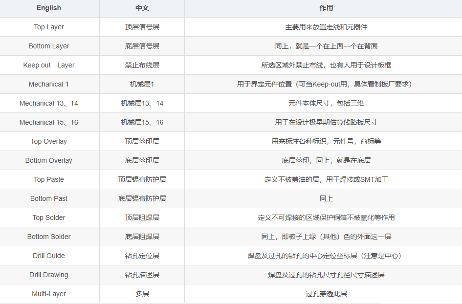

<iframe src="//player.bilibili.com/player.html?isOutside=true&aid=113266139402327&bvid=BV1ex12YrE9S&cid=26186550044&p=1" scrolling="no" border="0" frameborder="no" framespacing="0" allowfullscreen="true"></iframe>

本章不讲什么：
- 本章不会介绍原理图上任何电路设计的东西。
- 本章不会涉及PCB设计中任何铺铜等细节技术。

本章讲什么：
- 大概了解 AD 、立创 EDA 是怎么用的
- 如何学习电路设计、PCB 之类的（个人观点，仅供参考）

## 绘制的基本操作

[别人写的入门帖](https://blog.csdn.net/weixin_44062268/article/details/130557154)
 
[EDA软件对比](https://blog.csdn.net/chenhuanqiangnihao/article/details/140615657)

我的评价是电子 DIY，立创 EDA 够用了，而且国内最好用的之一。

### 需要知道

- 原理图是用来设计电路的，PCB 图是用来让工厂生产的。

- 手动布线是所有工程师的执念，美观好用。

- PCB 各层是用来做什么的 ↓

## 如何学习

首先，我不是这方面专家……

基本上电子 DIY 都要一块 MCU 作为核心来计算，常见的 MCU 也就只有那么几种，比如 ESP32、ESP8266、STM32等，它们都有相应的数据手册（这一块就是嵌入式编程相关的内容），因此相对套路化。所以我们想学的最好办法就是去抄、去复刻、然后理解。

**后续会考虑和大家一起抄一个项目，一步步来，学会从电路到嵌入式开发的电子 DIY 全流程。**