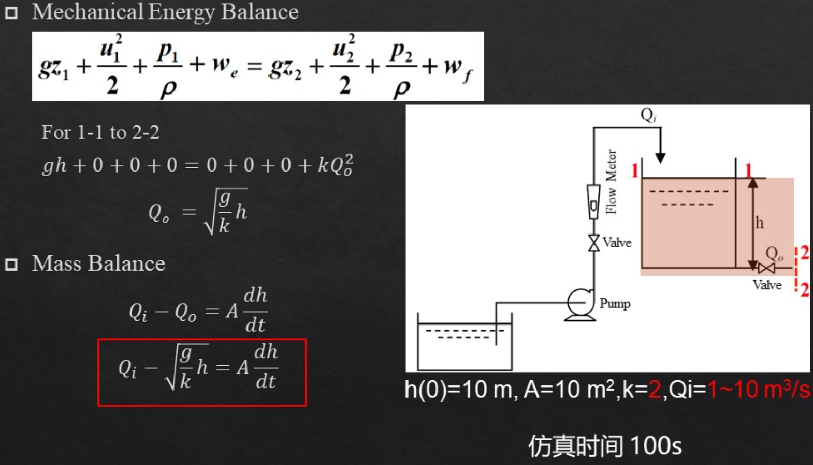
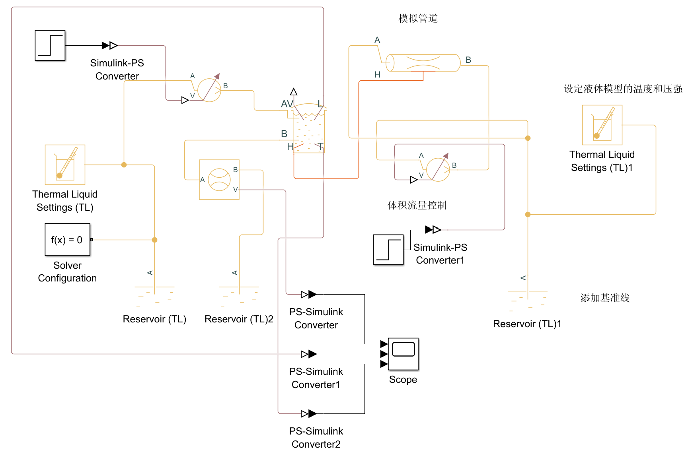

## MATLAB 安装与学习

### 介绍

你可以把 MATLAB 看作是一种编程语言，它可以用来进行数值计算、数据处理、图形绘制、控制系统建模、仿真等。它最大的特色在于**基本数据单位是矩阵**。所以很容易理解为什么官网上说它主要用于**数据处理**。在控制领域，矩阵计算是必备的，它这种存储方式以及内置的大量矩阵计算的函数提供了很好的便利性。

### 安装

本人声明不提倡安装盗版软件。

[这个视频](https://www.bilibili.com/video/BV1jZ421M7do)下面提供了**秘钥**，[这篇文章](https://blog.csdn.net/m0_63510299/article/details/139132501)提供了**软件安装包**，结合一下安装。打开 MATLAB 可能比较慢，它是这样的，习惯就好。

这些都是完整的安装包，内置 Simulink 等。MATLAB 官网上有学生版的 MATLAB ，估计没有 Simulink 这些。

### 教程

官网有现成的教程，那个非常的好，需要学校的邮箱注册（如果你所在的学校买了的话）

教程地址：https://matlab.mathworks.com/

另外根据学科分类有一套 MATLAB 和 Simulink 的课件：https://ww2.mathworks.cn/academia/courseware/search.html?q=&page=1

### MATLAB 学习方法

MATLAB 提供了大量大量的函数来帮助你计算、画图等等，是不可能学完的，它和嵌入式学习一样，**按需求来学习**。需要什么就去搜哪些可以实现你想要的功能。比如控制理论里面求状态反馈矩阵也有`acker`和`place`这样的函数。

## MATLAB 使用

### 判断语句

return语句能够使程序立即退出循环。

```matlab
if i<2
    i=i+1
    b=b+1
else 
    return;
end
```
### 循环语句

```matlab
for i=1:0.5:3
    a=a+1
end
```

### 绘图

1. plot(X,Y,LineSpec)

LineSpec（可省略）：是一个字符串，用来设置线的颜色、线宽、线型等。

| 线型 | 字符 | 符号 | 字符 | 颜色 | 字符 |
| ---- | ---- | ---- | ---- | ---- | ---- |
| 实线 | '-' | 圆点 | '.' | 红色 | 'r' |
| 虚线 | '--' | 星号 | '*' | 蓝色 | 'b' |
| 点线 | ':' | 加号 | '+' | 绿色 | 'g' |
| 点划线 | '-.' | 圆圈 | 'o' | 黄色 | 'y' |
|  |   | 正方形 |'s' | 青色 | 'c' |
|  |   | 上三角 | '^' | 品红 |'m' |
|  |   | 右三角 | '>' | 黑色 | 'k' |
|  |   | 左三角 | '<' | 白色 | 'w' |
|  |   | 六边形 | 'v' | 
|  |   | 五角星 | 'p' | 
|  |   | 六角形 | 'h' | 
|  |   | 十字  | 'x' | 

2. subplot(m,n,p)：设置子图的布局，m 和 n 表示行列数，p 表示第几个子图。
3. hold on; 维持窗口以便在一张图上画多条曲线
   
   hold off; 结束窗口维持
4. axis([xmin,xmax,ymin,ymax,zmin,zmax]):其中xmin、xmax、ymin、ymax、zmin、zmax分别表示所需坐标轴的x轴和y轴、z轴的最小和最大值
5. title('sin');  xlabel('x');  ylabel('y'); 标题、x轴、y轴标签
6. area(x,y,'FaceColor','b','EdgeColor','r','FaceAlpha',0.2)：多边形区域涂色，颜色、边框颜色、透明度
7. grid on; 网格线显示
8. legend('sin','cos')：图例显示

### 矩阵运算

方程求解：

```matlab
A = [6 3 4;
    -2,5,7;
    8,-1,-3];  % 左边系数
B = [3;-4;-7]; % 方程右边系数
x = inv(A)*B
```

求解特征值与特征向量：
```matlab
[v, lambda] = eig(A)
```

## Simulink

### 介绍

Simulink是用于动态系统和嵌入式系统的多领域仿真和基于模型的设计工具。对各种时变系统，包括通讯、控制、信号处理、视频处理和图像处理系统，Simulink提供了交互式图形化环境和可定制模块库来对其进行设计、仿真、执行和测试。

这里我们这里不讨论 Simulink 里面的 Simscape，后面单开一节简单聊一下。

### 基本使用

Simulink 包含以下基本库：
1. 常用模块：Simulink模型的基本构建模块，例如**输入、输出、示波器、常数输出、加减运算、乘除运算**等。
2. 连续函数模块：主要用于控制系统的拉氏变换中，主要为**积分环节**、传递函数、抗饱和积分、延迟环节等。
3. 非连续函数模块：主要为死区、信号的一阶导数Rate Limiter模块、阶梯状输出模块Quantizer模块、约定信号的输出的上下界Saturation以及Relay环节等。
4. 离散模块：主要将拉氏变换后的传递函数经 Z 变换离散化，从而实现传递函数的离散化建模，离散化系统容易进行程序移植，因此广泛应用在各种控制器仿真设计中，具体的离散模块库包括**延时Delay环节**、导数Difference、离散零极点配置Discrete Zero-Pole，离散时间积分环节等。
5. 逻辑控制器：主要逻辑位运算，用得少。
6. 数学模块：主要为绝对值计算Abs、加减运算Add、放大缩小倍数运算Gain、乘除运算Product等。
7. 数据输出显示库：包含有输出端Out1、示波器Scope、数据显示Display等模块，方便用户查看。

简单的操作：
1. 放置模块：从库当中拖入、双击空白的地方搜索（熟悉一些常见的模块：integrator、delay、gain、sum、product、abs、add、subtract、constant、scope、display等）
2. 连线：拖箭头到另一个箭头引入的地方；把模块放入到连线中间；一根线中间可以右键引出线

我们可以来实现一个阶跃输入的控制系统。


### S-function

很显然，它提供的这些模块并不能很好的满足我们想要仿真一些更复杂的系统的需求，因此它库当中有自定义的模块，这里我们介绍 s-function。下图为一个水箱模型，我们用 s-function 来实现它，并了解 s-function 的基本使用方法。



直接将阶跃模块与一个自定义的water模块相连，将输出直接给scope模块。编辑s-function water代码如下：

```matlab
function [sys,x0,str,ts] = fun(t,x,u,flag)
A = 10; % 横截面积 A
C = 2.21359; % 根号下g/k
iniState = 10; % 初始水位
% 不同标志位调用不同函数
switch flag
    case 0
    [sys,x0,str,ts]=mdlInitializeSizes(iniState);
    case 1
    sys=mdlDerivatives(t,x,u,A,C);
    case 2
    sys=mdlUpdate(t,x,u);
    case 3
    sys=mdlOutputs(t,x,u);
    case 4
    sys=mdlGetTimeOfNextVarHit(t,x,u);
    case 5
    sys=mdlTerminate(t,x,u);
    otherwise
    DAStudio.error('Simulink:blocks:unhandledFlag', num2str(flag));
end

function [sys,x0,str,ts]=mdlInitializeSizes(iniState)

sizes = simsizes;
sizes.NumContStates  = 1; %连续状态的数量
sizes.NumDiscStates  = 0; %离散状态的数量
sizes.NumOutputs     = 1;
sizes.NumInputs      = 1;
sizes.DirFeedthrough = 0; %输出y和输入u是否是直通（直接调用）
sizes.NumSampleTimes = 1;

sys = simsizes(sizes);
x0  = iniState;
str = [];
ts  = [0 0];

function sys=mdlUpdate(~,~,~)
sys = [];

function sys=mdlDerivatives(~,x,u,A,C)
% 根据水箱模型的公式得到的，sys即那个导数
sys = (u - C*sqrt(x))/A;

function sys=mdlOutputs(~,x,~)
% 这里的x就是公式中的高h
sys = x;

function sys=mdlGetTimeOfNextVarHit(t,~,~)
 % 每隔 1s 采一次样
sampleTime = 1;
sys = t + sampleTime;

function sys=mdlTerminate(~,~,~) % 终止条件
sys = [];
```

最上面可以设置停止时间。

## Simscape

Simscape 是 Simulink 的一个分支，专门用于控制系统的仿真。它是直接用物体的仿真模型，而不是抽象的方程和函数。我们可以用下面这个水温水箱模型来理解：



它会更复杂，可能要自己设置很多的参数，这个例子算是比较简单的，我们可以在官方提供的样例中找到更多很复杂的建模案例。比如，Simscape Fluids 当中 Refrigeration Cycle 模块，可以试着玩一下。

:::tip[学习建议]
Simscape 包含太多模块了，以上只是流体相关温度、流量等模块，此外仿真电子电路、物理模型等等。**重点不在于怎么使用它们，而在于你仿真所基于的原理是否正确，原理和设定值不对永远得不到预期的结果。**

学习方法就是，弄清楚要做什么，它的原理，再去找相关的模块，最后搭建和设置合理的参数，仿真。
:::

<div class="container-icon">
<a href="https://space.bilibili.com/3546706348084176" style="padding: 20px;font-size: 24px;text-decoration: none;" className="iconfont icon-bilibili"></a>
<a href="https://github.com/maindraster" style="padding: 20px;font-size: 24px;text-decoration: none;" className="iconfont icon-github"></a>
<a href="https://www.zhihu.com/people/wen-dao-81-2-70" style="padding: 20px;font-size: 24px;text-decoration: none;" className="iconfont icon-zhihu"></a>
</div>